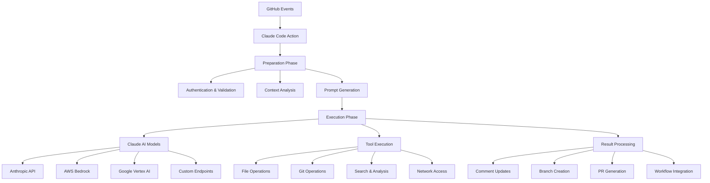

# Claude Code Action
## 革命性的 AI 驱动开发协作平台

### 产品路演演示
*Transform Your Development Workflow with AI*

---

## 🎯 市场机遇

### 开发团队面临的核心痛点
- **代码审查效率低下** - 人工审查耗时且容易遗漏问题
- **重复性工作繁重** - 代码重构、文档更新、测试编写
- **协作沟通成本高** - PR讨论冗长，反馈不及时
- **技术债务累积** - 缺乏系统性的代码质量管控

### 巨大的市场空间
- 全球软件开发者超过 **2600万人**
- GitHub 活跃用户超过 **1亿人**
- DevOps 市场规模预计 2028年达到 **573亿美元**
- AI辅助编程工具市场年增长率 **45%**

---

## 🚀 产品介绍

### Claude Code Action - 智能化GitHub工作流

> 将Claude AI无缝集成到GitHub开发流程中，实现智能化的代码审查、自动化开发任务和实时协作

### 核心价值主张
1. **零学习成本** - 在熟悉的GitHub界面中直接使用
2. **智能化决策** - AI理解代码上下文，提供精准建议
3. **全流程覆盖** - 从代码审查到自动化部署的完整支持
4. **企业级安全** - 支持私有部署和自定义API端点

---

## 💡 产品特性

### 🎪 智能触发系统
```yaml
# 简单的@claude提及即可启动AI助手
@claude 请优化这个函数的性能
@claude 添加单元测试
@claude 重构这段代码提高可读性
```

### 🔧 多模式运行
- **Tag模式** - 通过@claude提及触发
- **Agent模式** - 自动化批处理任务
- **Review模式** - 智能代码审查和建议

### 🌐 多云支持
- **Anthropic API** - 直接调用官方服务
- **AWS Bedrock** - 企业级云服务
- **Google Vertex AI** - 谷歌云AI平台
- **自定义端点** - 支持私有化部署

### 🛠️ 强大的工具集成
- 文件操作 (Read/Write/Edit)
- Git操作 (Commit/Push/Branch)
- 搜索和分析 (Grep/Glob)
- 网络访问 (可配置域名限制)

---

## 🎨 使用场景演示

### 场景1：智能代码审查
```
开发者提交PR → @claude审查代码 → AI分析并提供建议 → 自动创建优化分支
```

### 场景2：自动化重构
```
@claude 将这个类重构为更符合SOLID原则的设计
```
- AI理解现有代码结构
- 提供重构方案
- 自动实施代码变更
- 生成详细的变更说明

### 场景3：测试驱动开发
```
@claude 为新增的API端点添加完整的测试用例
```
- 分析API接口定义
- 生成单元测试和集成测试
- 包含边界条件和异常处理测试

---

## 📊 竞争优势

### 与现有解决方案对比

| 特性 | Claude Code Action | GitHub Copilot | CodeGuru | 传统工具 |
|------|-------------------|----------------|----------|---------|
| **GitHub原生集成** | ✅ 完全集成 | ⚠️ 编辑器插件 | ⚠️ 独立服务 | ❌ 需要切换 |
| **上下文理解** | ✅ 全仓库分析 | ⚠️ 文件级别 | ⚠️ 有限 | ❌ 无 |
| **自动化执行** | ✅ 端到端自动化 | ❌ 仅建议 | ❌ 仅分析 | ⚠️ 需配置 |
| **多云部署** | ✅ 全支持 | ❌ 仅OpenAI | ❌ 仅AWS | ❌ 无 |
| **企业安全** | ✅ 私有化支持 | ⚠️ 有限 | ✅ 企业级 | ⚠️ 取决于供应商 |

### 技术护城河
- **深度GitHub集成** - 原生支持所有GitHub功能
- **多模态AI能力** - 理解代码、文档、图片等多种内容
- **灵活部署架构** - 支持公有云、私有云、混合云
- **可扩展工具系统** - 开放的插件架构

---

## 💰 商业模式

### 多层次定价策略

#### 🆓 开源版本 (免费)
- 基础功能开源
- 社区支持
- 适合个人开发者和小团队

#### 💼 企业版本 ($99/月/团队)
- 高级AI模型
- 企业级安全
- 私有化部署
- 专业技术支持

#### 🏢 定制解决方案 (议价)
- 完全定制化开发
- 专属部署和运维
- SLA保障
- 培训和咨询服务

### 收入来源
1. **SaaS订阅收入** - 持续稳定的现金流
2. **私有化部署** - 高价值企业客户
3. **专业服务** - 咨询、培训、定制开发
4. **API调用分成** - 与云服务商的收入分享

---

## 📈 市场策略

### 目标客户群体

#### 一级目标 - 中大型技术团队
- 50-500人的开发团队
- 已采用GitHub Enterprise
- 注重代码质量和开发效率
- 预算充足，决策周期短

#### 二级目标 - 开源社区
- 活跃的开源项目维护者
- 通过免费版本获得口碑传播
- 培养用户习惯，后续转化付费

#### 三级目标 - 个人开发者
- 技术敏感用户
- 早期采用者和意见领袖
- 提供产品反馈和改进建议

### 增长策略
1. **产品导向增长** - 提供卓越用户体验
2. **社区营销** - 开源贡献和技术分享
3. **合作伙伴计划** - 与GitHub、云服务商合作
4. **内容营销** - 技术博客、案例研究、白皮书

---

## 🎯 产品路线图

### Q1 2024 - 基础版本发布
- ✅ 核心功能开发完成
- ✅ 多云提供商支持
- ✅ 基础安全特性
- 🎯 首批企业客户签约

### Q2 2024 - 功能增强
- 🔄 高级代码分析能力
- 🔄 更多编程语言支持
- 🔄 团队协作功能
- 🎯 用户增长300%

### Q3 2024 - 企业化升级
- 📋 企业级权限管理
- 📋 审计日志和合规性
- 📋 大规模部署支持
- 🎯 ARR达到100万美元

### Q4 2024 - AI能力提升
- 📋 多模态内容理解
- 📋 自然语言交互
- 📋 智能工作流编排
- 🎯 成为GitHub AI生态核心玩家

---

## 👥 团队介绍

### 核心团队优势
- **深厚的AI技术背景** - 来自顶级科技公司的AI专家
- **丰富的开发工具经验** - GitHub、微软、谷歌等公司背景
- **强大的执行能力** - 已成功交付MVP产品
- **广泛的行业网络** - 在开发者社区具有影响力

### 顾问团队
- **前GitHub CTO** - 产品战略指导
- **AI领域专家** - 技术发展方向
- **企业服务资深人士** - 商业化路径

---

## 💎 融资需求

### 资金用途 ($5M A轮)
- **产品研发 (40%)** - 核心功能迭代和新特性开发
- **市场拓展 (30%)** - 销售团队建设和市场推广
- **团队扩张 (20%)** - 招聘顶级工程师和产品专家  
- **基础设施 (10%)** - 云服务和安全合规投入

### 里程碑目标
- **12个月内** - 1000+企业用户，ARR达到500万美元
- **24个月内** - 成为GitHub AI工具类别第一名
- **36个月内** - 准备B轮融资，估值突破1亿美元

---

## 🌟 投资亮点

### 为什么选择Claude Code Action?

#### 🎯 巨大的市场机遇
- 搭乘AI和DevOps双重风口
- 明确的客户需求和付费意愿
- 可扩展的全球市场

#### 🚀 技术领先优势
- 国际领先的AI能力
- 深度的GitHub生态集成
- 灵活的多云架构

#### 💼 清晰的商业路径
- 已验证的产品市场匹配
- 多样化的收入来源
- 可预测的订阅模式

#### 👥 顶级团队配置
- 经验丰富的创始团队
- 强大的技术执行力
- 优秀的行业资源

---

## 📞 联系我们

### 让我们一起重新定义开发协作的未来

**产品演示**: 扫码体验Claude Code Action

**商务合作**: business@claude-code-action.com

**技术交流**: tech@claude-code-action.com

**投资洽谈**: invest@claude-code-action.com

---

*Claude Code Action - 让AI成为你最得力的开发伙伴*

**Thank You!**

---

### 附录：技术架构图



### 关键技术指标
- **响应时间**: < 30秒 (95%ile)
- **可用性**: 99.9% SLA
- **并发支持**: 1000+ 同时执行
- **安全合规**: SOC2、ISO27001认证